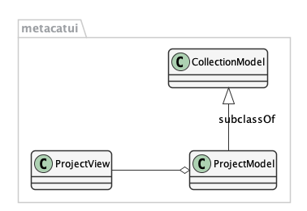
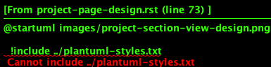
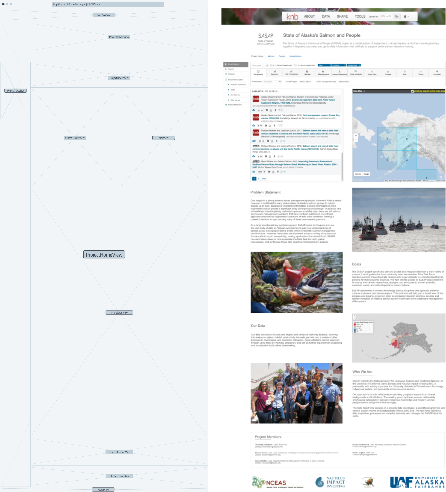
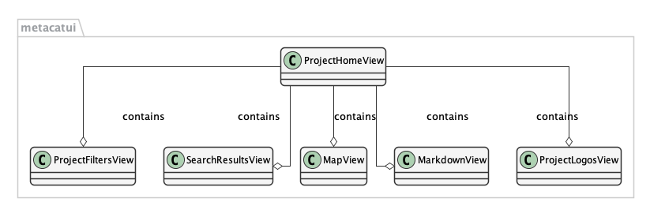

.. sectnum::

Project Pages Feature
=====================

This document provides an overview architecture for incorporating the project pages feature into the MetacatUI web application. The goal is to support the display of project-specific metadata that is configurable by a project owner.  The four envisioned views currently include a project home, project metrics, project people, and project visualizations.

Architecture
------------

Project View
~~~~~~~~~~~~

Each scientific project is rendered as a customizable ``ProjectView`` object, and is shown when the application router routes to ``/projects/:id/(:home)`` where the required ``id`` is an identifier reference to (like ``urn:uuid:xxxx-xxxx-xxxx-xxxx``), or a proxy for (like ``SASAP``) the project definition instance file stored in the repository.  The following wireframe shows how the ``ProjectView`` is rendered inside of the application ``#Content`` area.  Note that the ``NavbarView`` and the ``FooterView`` are rendered by the ``AppView`` parent container.

.. image:: images/project-view-wireframe.png
    :width: 50%

The router instantiates a ``ProjectView`` object, which has an associated ``ProjectModel`` object as its Backbone model.  The ``ProjectModel`` is a subclass of a ``CollectionModel``.

..
  @startuml images/project-model-view-design.png
  
    !include ../plantuml-styles.txt
    
    package metacatui {
      class ProjectModel {
      }
      class CollectionModel {
      }
      class ProjectView {
      }
    }
    
    CollectionModel <|-down- ProjectModel: "subclassOf"
    ProjectView -left-o ProjectModel: listensTo
    
  @enduml
  

The ``ProjectView`` contains three subviews: a ``ProjectHeaderView`` for the main branding, a ``TOCView`` for the table of contents, and a ``ProjectSectionView`` for the main project content.

..
  @startuml images/project-view-design.png
  
    !include ../plantuml-styles.txt
    
    package metacatui {
      class ProjectView {
      }
      class ProjectHeaderView {
      }
      class TOCView {
      
      }
      class ProjectSectionView {
      }
    }
    
    ProjectView --o TOCView : "                  subview               "
    ProjectView --o ProjectSectionView : "subview"
    ProjectView --o ProjectHeaderView : "subview"
  @enduml
  
.. image:: images/project-view-design.png

The ``ProjectSectionView`` is an abstract generic view with a simple ``MarkdownView`` subview that will be rendered if the ``ProjectSectionView`` is not overridden by a subclass.  The ``ProjectSectionView`` is extended with specific specialty views, including a ``ProjectHomeView``, ``ProjectMetricsView``, ``ProjectMembersView``, and ``ProjectVisualizationsView``.  These four views visually translate to the four tabs of a ``ProjectView``.

..
  @startuml images/project-section-view-design.png
  
    !include ../plantuml-styles.txt
    
    package metacatui {
      class ProjectSectionView {
      }
      class ProjectHomeView {
      }
      class ProjectMetricsView {
      }
      class ProjectMembersView {
      }
      class ProjectVisualizationsView {
      }
      class MarkdownView {
      }
    }
    
    ProjectSectionView -left-o MarkdownView : "subview"
    ProjectSectionView <|-down- ProjectHomeView : subclassOf
    ProjectSectionView <|-down- ProjectMetricsView : subclassOf
    ProjectSectionView <|-down- ProjectMembersView : subclassOf
    ProjectSectionView <|-down- ProjectVisualizationsView : subclassOf
  @enduml
  

Project Home View
~~~~~~~~~~~~~~~~~
As stated above, a ``ProjectHomeView`` is a specialized ``ProjectSectionView``. The wireframe on the left shows the subview layouts, based on the example on the right.

The ``ProjectHomeView`` contains a number of subviews, including a ``ProjectFiltersView``, a ``SearchResultsView``, a ``MapView``, a ``MarkdownView``, a ``ProjectMembersView``, and a ``ProjectLogosView`` The ``ProjectMembersView`` is a subset of the whole view, showing just the members with a particular attribute (like ``role: PrinciplaInvesigator``).

..
  @startuml images/project-home-view-design.png
  
    !include ../plantuml-styles.txt
    
    package metacatui {
      class ProjectHomeView {
      }
      class ProjectFiltersView {
      }
      class SearchResultsView {
      }
      class MapView {
      }
      class MarkdownView {
      }
      class ProjectMembersView {
      }
      class ProjectLogosView {
      }
    }
    
    ProjectHomeView --o ProjectFiltersView : contains
    ProjectHomeView --o SearchResultsView : contains
    ProjectHomeView --o MapView : contains
    ProjectHomeView --o MarkdownView : contains
    ProjectHomeView --o ProjectMembersView : contains
    ProjectHomeView --o ProjectLogosView : contains
  @enduml
  

