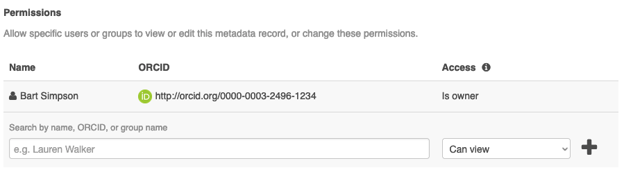
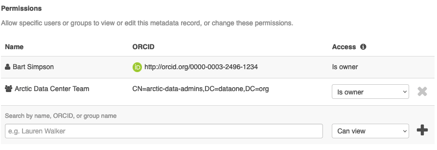

Jump to:

1. [Setting a default access policy](#setting-a-default-access-policy-for-uploads)
2. [Hiding a group or person in the access policy](#hiding-a-group-or-person-in-the-access-policy-editor)

---

## Setting a default access policy for uploads

When data files, metadata documents, and resource maps are uploaded to your repository
through the MetacatUI dataset editor, each upload is assigned a [DataONE Access Policy](https://releases.dataone.org/online/api-documentation-v2.0.1/apis/Types.html#Types.AccessPolicy). Access Policies define who can view, edit, or edit ownership of an object.

To define the default Access Policy of objects uploaded to your repository,
define a [`defaultAccessPolicy` configuration option](../docs/AppConfig.html#defaultAccessPolicy) in the `AppConfig` object.

In your `AppConfig`, set the default access policy via the `defaultAccessPolicy` attribute. The default access policy is an array of literal objects
with the following attributes:
`subject`, `read`, `write`, and `changePermission`.

The values of these attributes will be serialized to the system metadata of each object uploaded via the MetacatUI editor.

This default access policy makes all objects publicly readable:

```javascript
[
  {
    subject: "public",
    read: true,
    write: false,
    changePermission: false,
  },
];
```

The above access policy will be serialized into the system metadata as:

```xml
  <accessPolicy>
    <allow>
      <subject>public</subject>
      <permission>read</permission>
    </allow>
  </accessPolicy>
```

#### Examples:

- Make all objects publicly viewable

  ```js
  defaultAccessPolicy: [
    {
      subject: "public",
      read: true,
      write: false,
      changePermission: false,
    },
  ];
  ```

- Make all objects private

  ```js
  defaultAccessPolicy: [
    {
      subject: "public",
      read: false,
      write: false,
      changePermission: false,
    },
  ];
  ```

- Make all objects private but give an administrative group access to view, edit, and edit ownership

  ```js
  defaultAccessPolicy: [
    {
      subject: "public",
      read: false,
      write: false,
      changePermission: false,
    },
    {
      subject: "CN=data-admins,DC=dataone,DC=org", //Your admin group ID/subject
      read: true,
      write: true,
      changePermission: true,
    },
  ];
  ```

## Hiding a group or person in the access policy editor

Sometimes it is helpful to hide a group or person, such as repository managers and admins, in the Access Policy editor (i.e. the "Share" or "Sharing Options" panel) so that non-admins cannot remove that person from the access policy.

Add group or person subjects that should be hidden to the [`hiddenSubjectsInAccessPolicy`](https://nceas.github.io/metacatui/docs/AppConfig.html#hiddenSubjectsInAccessPolicy) array in the `AppConfig`.

### Example

This repository has an admin group, `CN=arctic-data-admins,DC=dataone,DC=org`, which is hidden in the MetacatUI configuration.

The researcher Bart Simpson uploaded a dataset and does not see the admin group in the Sharing panel:



But all people in the `CN=arctic-data-admins,DC=dataone,DC=org` group can see the group in the Sharing panel:


