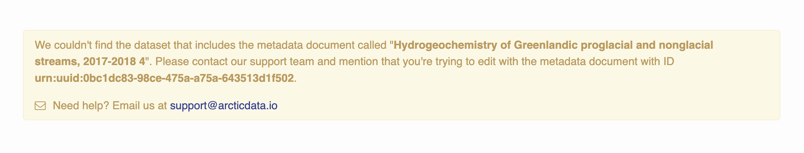
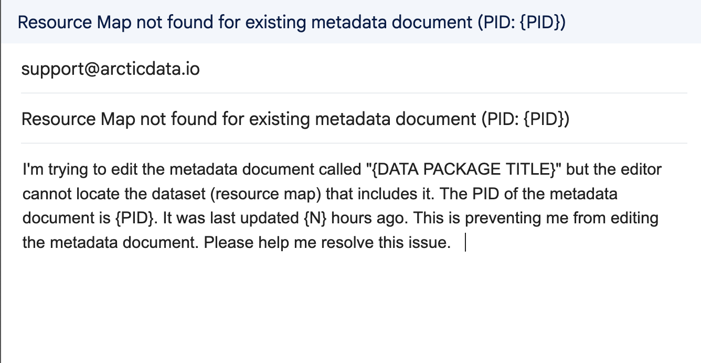

MetacatUI includes a `ResourceMapResolver` utility (introduced in v2.34) that improves how data package relationships are resolved during editing. The resolver uses multiple strategies to locate the resource map for a given metadata PID.

In earlier versions of MetacatUI, the editor searched only the Solr index. If a resource map wasn't found, it would create a new one. This made sense only in rare cases where a metadata document had never been part of a data package. In most cases, it caused confusion when a document was part of a data package but the resource map wasn't found, for example due to delayed indexing. Starting in version 2.34, the resolver can find a resource map even if it is not indexed yet by using system metadata or local storage. It will also never create a new resource map for an existing metadata document, which helps avoid broken obsolescence chains and apparent missing data from packages.

## How the Resource Map Resolver Works

The `ResourceMapResolver` attempts the following strategies, in order, to locate a resource map for a given metadata PID:

- Searching the Solr index
- Checking the local cache, where previously found resource map–metadata PID relationships are stored
- Walking the obsolescence chain using system metadata. The resolver walks the metadata's obsolescence chain backward to find the first PID with a resource map in Solr, then walks the resource map's obsolescence chain forward the same number of steps to find the matching resource map.
- Guessing the resource map PID using the naming convention `resource_map_{metadata PID}`, then verifying its existence and relationship to the metadata PID

## When No Resource Map Is Found

If none of these strategies find a resource map, the resolver notifies the user that it could not locate one for the metadata document being edited. The notification includes a link to contact support, pre-filled with the document’s title and PID, making it easier for users to report the issue.





## Tracking Resource Map Resolution Failures

When all resolution strategies fail, it usually means that an existing metadata document does not have a resource map associated with it. This can happen for various reasons and often requires investigation or manual intervention. When this occurs, MetacatUI emits a custom event to Google Analytics.

This helps repository managers identify which metadata records may need attention. The event is sent to Google Analytics 4 (GA4) using the following format:

```js
gtag('event', 'resource_map_missing', { pid: '{UUID/DOI}' });
```

This event:
  - Fires once per PID per page load
  - Includes the PID of the affected metadata document
  - Is emitted only when all resolution strategies fail

To make use of this feature, repository managers can set up a custom dimension in Google Analytics to track the pid parameter. This allows for filtering and reporting on which PIDs are missing resource maps.

### Viewing and Filtering `resource_map_missing` Events in GA4

To view and filter these events in GA4:
1. Open your GA4 property
2. Navigate to Reports → Engagement → Events
3. Look for the event named `resource_map_missing`
4. To view the pid values, follow the steps below to register a custom dimension

### Setting Up the `pid` Parameter in GA4

To access pid values in GA4 reports:
1. Go to Admin → Custom Definitions
2. Click Create custom dimension
3. Fill out the form:
  - Dimension name: pid
  - Scope: Event
  - Event parameter: pid
4. Click Save

Once configured, pid will appear as a filterable and reportable field in Explorations and event reports going forward. Note that this is not retroactive.