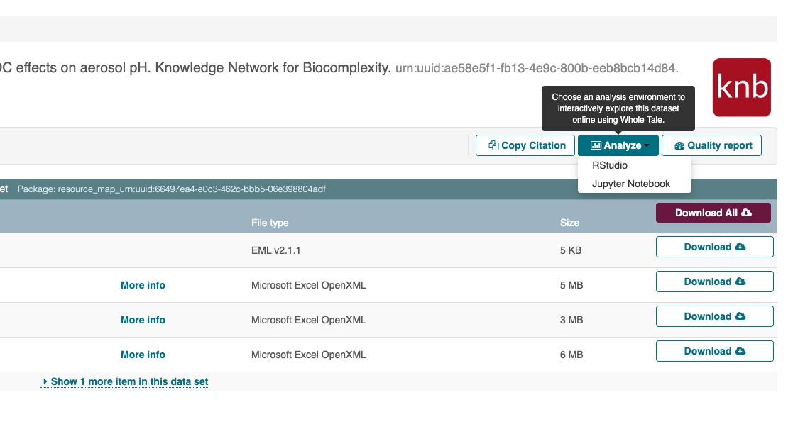

.. sectnum::

Using Datasets With Third Parties
=================================

This document provides an overview of how to integrate third parties with the DataONE "Analyze" feature.

Overview
--------

Datasets within DataONE are relatively static. Metadata can be modified, packages can be obsoleted, but code cannot be run within the system.
There are many third party services that allow users to upload their code and data so that they can use a pre-packaged environment to run their analyses. These services
include Binder, Code Ocean, CoCalc, and Whole Tale. Some of these services provide APIs that allow third parties to launch interactive environments.

Currently, DataONE supports the Whole Tale API to do this.

Implementation
--------------
This feature is exposed to the user via a dropdown menu that appears on each dataset, shown below

Showing/Hiding the Dropdown
^^^^^^^^^^^^^^^^^^^^^^^^^^^
This feature is disabled by default. To enable it, change the ``showWholeTaleFeatures`` flag in the AppModel.js file.

Adding an environment
^^^^^^^^^^^^^^^^^^^^^
Whole Tale provides a number of environments. Some of them are more relevant for the DataONE user base. To add or remove an environment,
modify the ``taleEnvironments`` array in the AppModel.js file. The name of the environment should match the environment
name shown in the Whole Tale user interface. Note that it is not case sensitive.

Adding Additional Third Party Services
^^^^^^^^^^^^^^^^^^^^^^^^^^^^^^^^^^^^^^
To add additional services beyond Whole Tale, you'll want to

1. Create the following variables in AppModel.js::

      show<service-name>Features: false,
      
      <service-name>Environments: ["environment1", "environment2"],
      
      <service-name>URL: "API URL"

2. Modify the ``insertControls`` method in MetadataView.js to check if the service should be enabled (by using the show<service-name>Features flag).

3. Add a method ``create<service-name>Button`` method in MetadataView.js that gets triggered if ``show<service-name>Features`` is true. This method should loop over your ``<service-name>Environments`` variable, adding them to the ``analyze.dropdown-menu`` element. It should be created as a link, pointing to  the API specified by ``<service-name>URL``.
