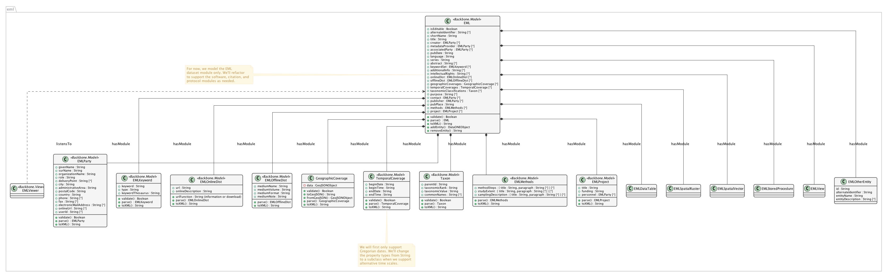

..
   @startuml images/editor-design-eml-package.png  

     !include plantuml-styles.txt

     ' override the linetype
     skinparam linetype ortho   
  

     package eml {
       class EML <<Backbone.Model>> {
         + isEditable : Boolean
         + alternateIdentifier : String [*]
         + shortName : String
         + title : String
         + creator : EMLParty [*]
         + metadataProvider : EMLParty [*]
         + associatedParty  : EMLParty [*]
         + pubDate : String
         + language : String
         + series : String
         + abstract : String [*]
         + keywordSet : EMLKeyword [*]
         + additionalInfo : String [*]
         + intellectualRights : String [*]
         + onlineDist : EMLOnlineDist [*]
         + offlineDist : EMLOfflineDist [*]
         + geographicCoverages : GeographicCoverage [*]
         + temporalCoverages : TemporalCoverage [*]
         + taxonomicClassifications : Taxon [*]
         + purpose : String [*]
         + contact : EMLParty [*]
         + publisher : EMLParty [*]
         + pubPlace : String
         + methods : EMLMethods [*]
         + project : EMLProject [*]
         + validate() : Boolean
         + parse()  : EML
         + toXML() : String
         + addEntity() : DataONEObject
         + removeEntity() : String
       }
       
       note left
         For now, we model the EML
         dataset module only. We'll refactor
         to support the software, citation, and
         protocol modules as needed.
       end note
         
       class EMLViewer <<Backbone.View>> {
       }
       
       class EMLParty <<Backbone.Model>> {
         + givenName : String
         + surName : String
         + organizationName : String
         + role : String
         + deliveryPoint : String [*]
         + city : String
         + administrativeArea : String
         + postalCode : String
         + country : String
         + phone : String [*]
         + fax : String [*]
         + electronicMailAddress : String [*]
         + onlineUrl : String [*]
         + userId : String [*]
         + validate() : Boolean
         + parse()  : EMLParty
         + toXML() : String
       }
       
       class EMLKeyword <<Backbone.Model>> {
         + keyword : String
         + type : String
         + keywordThesaurus : String
         + validate() : Boolean
         + parse()  : EMLKeyword
         + toXML() : String
       }
       
       class EMLOnlineDist <<Backbone.Model>> {
         + url : String
         + urlFunction : String (information or download)
         + onlineDescription : String
         + parse() : EMLOnlineDist
         + toXML() : String
       }
       
       class EMLOfflineDist <<Backbone.Model>> {
         + mediumName : String
         + mediumVolume : String
         + mediumFormat : String
         + mediumNote : String
         + parse() : EMLOfflineDist
         + toXML() : String
       }
              
       class GeographicCoverage {
         - data : GeoJSONObject
         + validate() : Boolean
         + toGeoJSON() : String
         + fromGeoJSON() : GeoJSONObject
         + parse() : GeographicCoverage
         + toXML() : String
       }
       
       class TemporalCoverage <<Backbone.Model>> {
         + beginDate : String
         + beginTime : String
         + endDate : String
         + endTime : String
         + validate() : Boolean
         + parse() : TemporalCoverage
         + toXML() : String
       }
       
       note bottom
         We will first only support
         Gregorian dates. We'll change
         the property types from String
         to a subclass when we support
         alternative time scales.
       end note
       
       class Taxon <<Backbone.Model>> {
         + parentId : String
         + taxonomicRank : String
         + taxonomicValue : String
         + commonNames : String [*]
         + validate() : Boolean
         + parse() : Taxon
         + toXML() : String
       }
                
       class EMLMethods <<Backbone.Model>> {
       	 + methodSteps : { title : String, paragraph : String [*] } [*]
       	 + studyExtent : { title : String, paragraph : String [*] } [*]
       	 + samplingDescription : { title : String, paragraph : String [*] } [*]
         + parse() : EMLMethods
         + toXML() : String
       }
       
       class EMLProject <<Backbone.Model>> {
         + title : String
         + funding : String 
         + personnel : EMLParty [*]
         + parse() : EMLProject
         + toXML() : String
       }
       
       class EMLDataTable {
       }
       
       class EMLSpatialRaster {
       }
       
       class EMLSpatialVector {
       }
       
       class EMLStoredProcedure {
       }
       
       class EMLView {
       }
       
       class EMLOtherEntity {
         id : String
         alternateIdentifier : String
         entityName : String
         entityDescription : String [*]
         'physical : EMLPhysical
         
       }
       
     }
     
     EML *-- EMLParty : "hasModule"
     EML *-- EMLMethods : hasModule
     EML *-- EMLProject : hasModule
     EML *-- GeographicCoverage : "hasModule"
     EML *-- TemporalCoverage : "hasModule"
     EML *-- Taxon : "hasModule"
     EML *-- EMLOnlineDist : hasModule
     EML *-- EMLOfflineDist : hasModule
     EML *-- EMLKeyword : hasModule
     EML *-- EMLDataTable : hasModule
     EML *-- EMLSpatialRaster : hasModule
     EML *-- EMLSpatialVector : hasModule
     EML *-- EMLStoredProcedure : hasModule
     EML *-- EMLView : hasModule
     EML *-- EMLOtherEntity : hasModule
     EML <.. EMLViewer : listensTo
     
   @enduml

