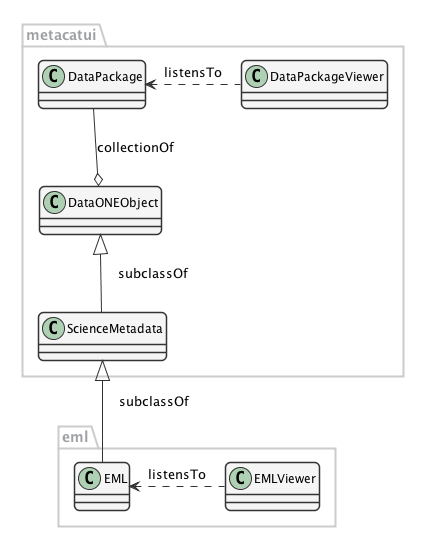
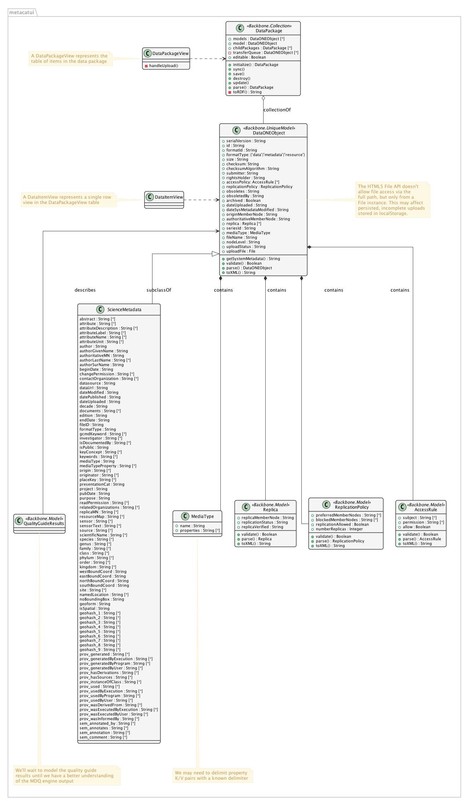

MetacatUI Editor Refactor
=========================

This document provides an overview architecture for incorporating a metadata editor into the MetacatUI web application. The goal is to support a number of use cases where a scientist needs to manage data and metadata in a Member Node repository.

Use Cases
---------
The following use cases are intended to represent basic data and metadata management functionality.

+--------------------------------+------------------------------------------------------------------+ 
|Use Case                        | Description                                                      | 
+================================+==================================================================+
| `Upload Data`_                 | Choose and upload files to the repository                        | 
+--------------------------------+------------------------------------------------------------------+
| `Rename a File`_               | Rename a data file                                               | 
+--------------------------------+------------------------------------------------------------------+
| `Add Metadata`_                | Add a dataset folder to contain data files                       | 
+--------------------------------+------------------------------------------------------------------+
| `Update Metadata`_             | Provide metadata details for a selected dataset folder           | 
+--------------------------------+------------------------------------------------------------------+
| `Archive a File`_              | Archive a data file in the repository                            | 
+--------------------------------+------------------------------------------------------------------+
| `View Public Metadata`_        | View a dataset description from a public perspective             | 
+--------------------------------+------------------------------------------------------------------+
| `Add a Nested Dataset`_        | Add a dataset folder into an existing dataset folder             | 
+--------------------------------+------------------------------------------------------------------+
| `Move Dataset Levels`_         | Move a dataset to a different position in the dataset hierarchy  | 
+--------------------------------+------------------------------------------------------------------+

.. _Upload Data:          ./use-cases/upload-data.rst
.. _Rename a File:        ./use-cases/rename-a-file.rst
.. _Add Metadata:         ./use-cases/add-metadata.rst
.. _Update Metadata:      ./use-cases/update-metadata.rst
.. _Archive a File:       ./use-cases/archive-a-file.rst
.. _View Public Metadata: ./use-cases/view-public-metadata.rst
.. _Add a Nested Dataset: ./use-cases/add-a-nested-dataset.rst
.. _Move Dataset Levels:  ./use-cases/move-dataset-levels.rst

Architecture
------------

While we see benefits in splitting the architecture into multiple libraries (metacaui and each supported science metadata language), pragmatically there are tight dependencies among the models.  Therefore, we'll keep the classes in one library, but will divide the functionality into separate model and view classes.
The EML class is a specialization of the generic ScienceMetadata class in the MetacatUI module.  We intend to support other specializations in the future (ISO 19139, FGDC CSDGM, etc.) 

Class Diagrams
--------------

Overview
~~~~~~~~

..
  @startuml images/editor-design.png
  
    !include plantuml-styles.txt
    
    package metacatui {
      class DataPackage {
      }
      
      class DataONEObject {
      }
      
      class ScienceMetadata {
      }
      
      class DataPackageView {
      }
      
      class EML {
      }
      
      class EMLViewer {
      }
    }
      
    DataPackage --o DataONEObject : collectionOf
    DataPackage <.left. DataPackageView : listensTo
    DataONEObject <|-down- ScienceMetadata : "    subclassOf"
    ScienceMetadata <|-down- EML : "    subclassOf"
    EML <.left. EMLViewer : listensTo
  @enduml
  

Detailed Class Diagrams
~~~~~~~~~~~~~~~~~~~~~~~

.. image:: images/editor-design-eml-package.png

Implementation Decisions
------------------------
- A DataONEObject can represent the three types of objects in a DataONE Member Node of Coordinating Node (DATA, METADATA, RESOURCEMAP). A data object will be represented by a DataONEObject with just the SystemMetadata properties populated.  Any science metadata can be represented by a ScienceMetadata subclass of DataONEObject, or an even more specialized subclass of ScienceMetadata (like EML).  While a DataPackage, which models a resource map, isn't a subclass of DataONEObject per se, we'll use a DataONEObject instance to represent it when calling MNStorage API methods for resource maps.
- The DataPackage's standard Backbone.Collection.models property stores the array of DataONEObjects that are directly aggregated by immediate resource map.  For nested packages, the DataPackage.childPackages property stores an array of immediate child packages. Each of these DataPackage Backbone.Collections store their immediate children.
- Each DataONEObject will get assigned a SID and a PID. When publish() is called, we assign a DOI to both the SID and the PID, separately. Citations with SIDs will return the latest data package, citations with PIDs will always return the same DataPackage.
- If we use SIDs as identifiers in the resource maps, when a sub package is changed, the parent packages up the chain will not need to be updated. If we use PIDs, all parent resource maps will need to be updated.
- The DataPackage object will extend Backbone.Collection, and we’ll keep track of both the parent package and the child packages using the Backbone-generated id for the object
- The EML.isEditable property will control whether or not the editor is enabled in the EMLView
- We’ll model the EML modules as minimally as needed, using complex types as needed, like EMLParty
- For now, for we will postpone modeling eml-text, eml-entity modules, and won’t support the maintenance tree
- Instead of modeling EML with its four submodules (dataset, software, citation, protocol, for now we’re keeping the model simple and only supporting EMLDataset
- We won’t support the references tag in `/eml/dataset`
- Object transfers will be queued on a per package basis, using the transferQueue property.  Each DataONEObject item in the queue will have an uploadStatus (queued, transferring, completed, modified). Science metadata that is locally modified, but not 'saved' yet will be in the modified status. Once the save event occurs, it changes to queued and is added to the queue.
