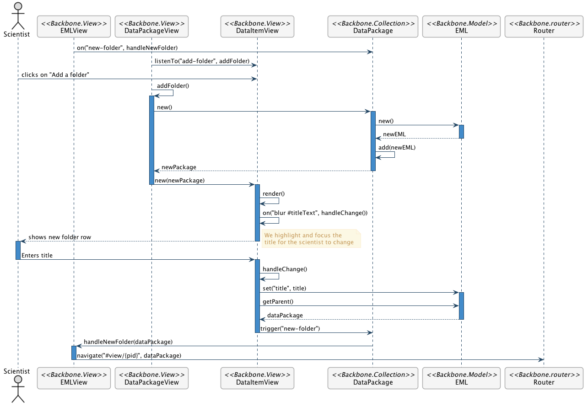

Add a Nested Dataset
====================

Scenario
--------

    As a scientist, I want to add a nested dataset to an existing dataset folder so I can easily organize related data.
    
Mockup Image
------------

.. image:: images/add-nested-dataset-mockup.png

Technical Sequence Diagram
---------------------------
.. @startuml images/add-nested-dataset-sequence-diagram.png

	!include ../plantuml-styles.txt
    skinparam SequenceGroupBorderColor #AAAAAA
    skinparam SequenceGroupBorderThickness #AAAAAA
 
    actor "Scientist"
  	participant EMLView as EMLView <<Backbone.View>>
  	participant DataPackageView as DataPackageView <<Backbone.View>>
  	participant DataItemView as DataItemView <<Backbone.View>>
  	participant DataPackage as DataPackage <<Backbone.Collection>>
  	participant EML as EML <<Backbone.Model>>
  	participant Router as Router <<Backbone.router>>
        
    EMLView -> DataPackage : on("new-folder", handleNewFolder)  
    DataPackageView -> DataItemView : listenTo("add-folder", addFolder)
    
    Scientist -> DataItemView : clicks on "Add a folder"
   
    DataPackageView -> DataPackageView : addFolder()
   	activate DataPackageView		
    	DataPackageView -> DataPackage : new()
    
	    activate DataPackage    
	    	DataPackage -> EML : new()
	    	activate EML
	    		EML --> DataPackage : newEML
	    	deactivate EML
	    	DataPackage -> DataPackage : add(newEML)
	    	DataPackage --> DataPackageView : newPackage
	    deactivate DataPackage
    
    	DataPackageView -> DataItemView : new(newPackage)
    deactivate DataPackageView
        
   	activate DataItemView
        DataItemView -> DataItemView : render()
        DataItemView -> DataItemView : on("blur #titleText", handleChange())
        DataItemView --> Scientist: shows new folder row
        note right
          We highlight and focus the
          title for the scientist to change
        end note
    deactivate DataItemView
    
    activate Scientist
        Scientist -> DataItemView : Enters title
      deactivate Scientist
      
  	activate DataItemView
    	DataItemView -> DataItemView : handleChange()
    	DataItemView -> EML : set("title", title)
    	activate EML
    		DataItemView -> EML : getParent()
    		EML --> DataItemView : dataPackage
    	deactivate EML
    	DataItemView -> DataPackage : trigger("new-folder") 
  	deactivate DataItemView

		DataPackage -> EMLView : handleNewFolder(dataPackage)    
	activate EMLView
    	EMLView -> Router : navigate("#view/{pid}", dataPackage)
    deactivate EMLView
    
   	@enduml
   	

