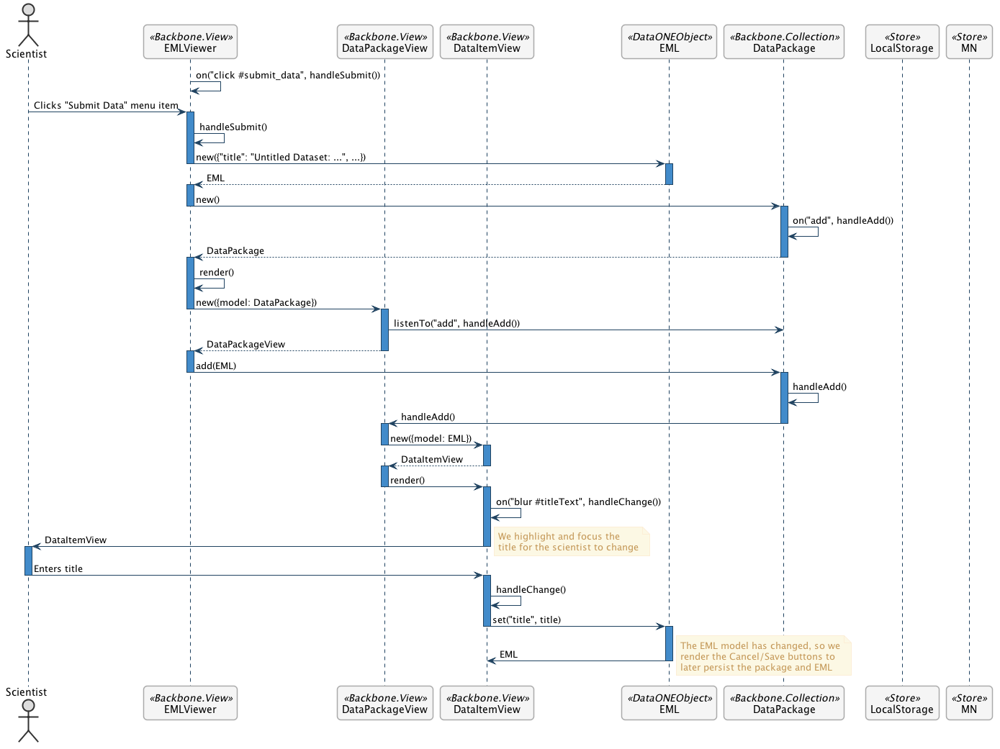

Add EML        
============

Scenario
--------

    As a scientist, I want to add metadata descriptions about data I have collected or used so I can share the contextual information with my colleagues.

Summary
-------
A scientist should be able to add metadata descriptions for their dataset.  The goal is to first add a top level dataset folder, with the name of the folder being the title of the dataset.  When the scientist clicks on "Submit Data" anywhere in the app, a dialog should prompt them to provide a dataset title. The science metadata should be updated with the title, creator, and contact information. The package describing the eml should be updated, and the metadata and package should be created in the repository.  All future edits are updates.  

Mockup Image
------------

.. image:: images/Add-a-Folder-Modal-Dialog.png

Technical Sequence Diagram
--------------------------

.. 
    @startuml images/add-a-folder-sequence-diagram.png

      !include ../plantuml-styles.txt
      skinparam SequenceGroupBorderColor #AAAAAA
      skinparam SequenceGroupBorderThickness #AAAAAA

      actor "Scientist"
      participant EMLViewer as View <<Backbone.View>>
      participant AddFolderView as AddFolderView  <<ModalView>>
      participant DataPackageView as PackageView  <<Backbone.View>>
      participant DataPackage as DataPackage <<Backbone.Collection>>
      participant dataPackage as "dataPackage:DataPackage" <<Backbone.Collection>>
      participant EML as EML <<DataONEObject>>
      participant eml as "eml:EML" <<DataONEObject>>
      participant LocalStorage as LocalStore  <<Store>>
      participant MN as MN  <<Store>>

      View -> View : on("click #submit_data", handleSubmit())
      View -> dataPackage : listenTo("add", handleAdd())
      Scientist -> View : Clicks "Submit Data" menu item

      activate View
        View -> View : handleSubmit()
        View -> DataPackage : new()
      deactivate View
      
      activate DataPackage
        DataPackage --> View : dataPackage
      deactivate DataPackage

      dataPackage -> dataPackage : on("add", handleAdd())
      
      View -> dataPackage : listenTo("add", handleAdd())
      activate View
        View -> View : render()
        note right
          We render an empty EML
          View behind the dialog
        end note
        View --> AddFolderView : render()
      deactivate View

      activate AddFolderView
        AddFolderView -> AddFolderView : on("click #save", handleSave())
        AddFolderView -> AddFolderView : on("click #cancel", handleCancel())
        AddFolderView --> Scientist : Save? Cancel?
        note right
          Presents dialog to set the 
          dataset title (and folder name)
        end note
      deactivate AddFolderView
      
      Scientist -> AddFolderView : Clicks "Save"
      
      activate AddFolderView
        AddFolderView -> AddFolderView : handleSave()
        AddFolderView -> AddFolderView : validate()
        AddFolderView -> EML : new({"id": pid, "title": title, ...})
      deactivate AddFolderView
      
      activate EML
        EML --> AddFolderView : eml
      deactivate EML
      
      activate AddFolderView
          AddFolderView -> eml: save()
      deactivate AddFolderView

      activate eml
        eml -> MN : create(pid, sysmeta, object)
      deactivate eml
      
      activate MN
        MN --> eml : identifier
      deactivate MN

      activate eml
        eml --> AddFolderView : eml
      deactivate eml

      activate AddFolderView
        AddFolderView -> dataPackage : add(eml)
      deactivate AddFolderView
      
      activate dataPackage
        dataPackage -> dataPackage : handleAdd()
        dataPackage --> View : handleAdd()
      deactivate dataPackage
      
      activate View
        View -> View : render()
        View -> PackageView : render()
      deactivate View
      
      activate PackageView
        PackageView --> View : packageView
      deactivate PackageView
      note left
        Scientist sees new dataset folder
        and empty metadata fields
      end note
    @enduml
    

      
