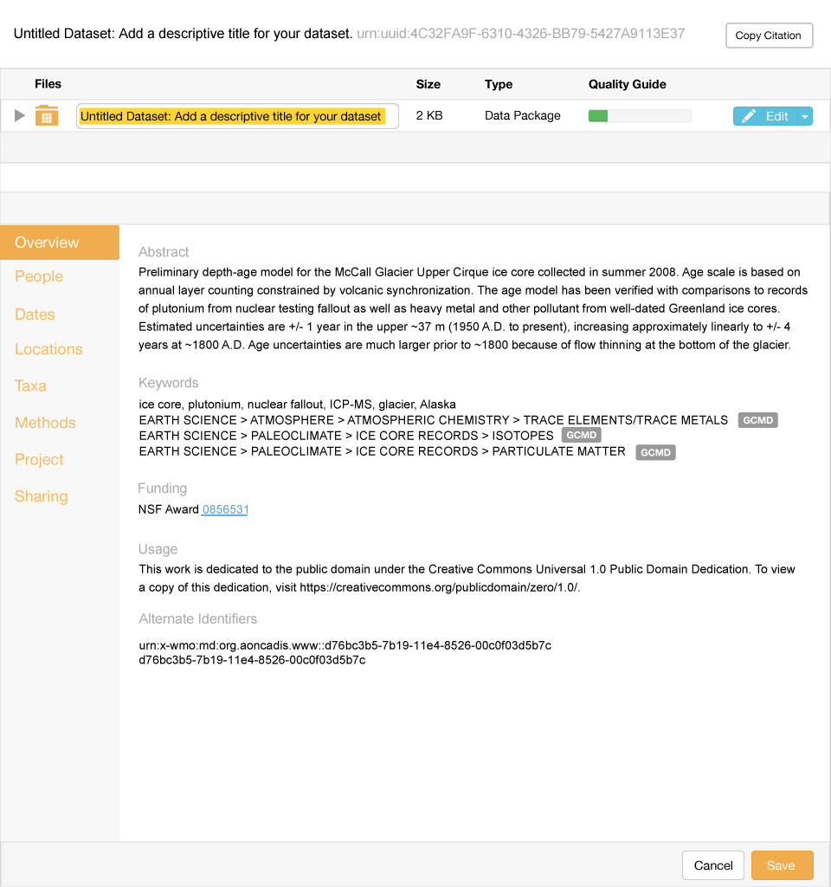

Add EML        
============

Scenario
--------

    As a scientist, I want to add metadata descriptions about data I have collected or used so I can share the contextual information with my colleagues.

Summary
-------
A scientist should be able to add metadata descriptions for their dataset.  The goal is to first add a top level dataset folder, with the name of the folder being the title of the dataset.  When the scientist clicks on "Submit Data" anywhere in the app, a dialog should prompt them to provide a dataset title. The science metadata should be updated with the title, creator, and contact information. The package describing the metadata should be updated, and the metadata and package should be created in the repository.  All future edits are updates.  

Mockup Image
------------

Technical Sequence Diagram
--------------------------

.. 
    @startuml images/add-a-folder-sequence-diagram.png

      !include ../plantuml-styles.txt
      skinparam SequenceGroupBorderColor #AAAAAA
      skinparam SequenceGroupBorderThickness #AAAAAA

      actor "Scientist"
      participant EMLViewer as View <<Backbone.View>>
      participant DataPackageView as PackageView <<Backbone.View>>
      participant DataItemView as DataItemView <<Backbone.View>>
      participant EML as EML <<DataONEObject>>
      participant DataPackage as DataPackage <<Backbone.Collection>>
      participant LocalStorage as LocalStore <<Store>>
      participant MN as MN <<Store>>

      View -> View : on("click #submit_data", handleSubmit())
      Scientist -> View : Clicks "Submit Data" menu item

      activate View
        View -> View : handleSubmit()
        View -> EML : new({"title": "Untitled Dataset: ...", ...})
      deactivate View
      
      activate EML
        EML --> View : EML
      deactivate EML
      
      activate View
        View -> DataPackage : new()
      deactivate View
      
      activate DataPackage
      DataPackage -> DataPackage : on("add", handleAdd())
         DataPackage --> View : DataPackage
      deactivate DataPackage
      
      
      
      activate View
        View -> View : render()
        View -> PackageView : new({model: DataPackage})
      deactivate View

      activate PackageView
        PackageView -> DataPackage : listenTo("add", handleAdd())
        PackageView --> View : DataPackageView
      deactivate PackageView

      activate View
        View -> DataPackage : add(EML)
      deactivate View
      
      activate DataPackage
        DataPackage -> DataPackage : handleAdd()
        DataPackage -> PackageView : handleAdd()
      deactivate DataPackage
      
      activate PackageView
        PackageView -> DataItemView : new({model: EML})
      deactivate PackageView
      
      activate DataItemView
        DataItemView --> PackageView : DataItemView
      deactivate DataItemView
            
      activate PackageView
        PackageView -> DataItemView : render()
      deactivate PackageView
      
      activate DataItemView
        DataItemView -> DataItemView : on("blur #titleText", handleChange())
        DataItemView -> Scientist: DataItemView
        note right
          We highlight and focus the
          title for the scientist to change
        end note
      deactivate DataItemView

      activate Scientist
        Scientist -> DataItemView : Enters title
      deactivate Scientist
      
      activate DataItemView
        DataItemView -> DataItemView : handleChange()
        DataItemView -> EML : set("title", title)
      deactivate DataItemView
      
      
      activate EML
        EML -> DataItemView : EML
        note right
          The EML model has changed, so we
          render the Cancel/Save buttons to 
          later persist the package and EML
        end note
      deactivate EML
      
    @enduml
    
.. image:: images/add-a-folder-sequence-diagram.png

      
