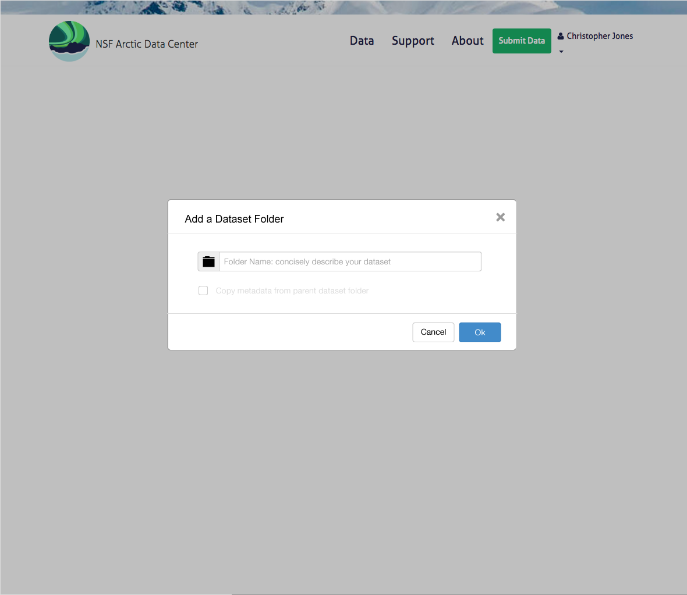

Add Metadata        
============

Scenario
--------

    As a scientist, I want to add metadata descriptions about data I have collected or used so I can share the contextual information with my colleagues.

Summary
-------
A scientist should be able to add metadata descriptions for their dataset.  The goal is to first add a top level dataset folder, with the name of the folder being the title of the dataset.  The package describing the data and metadata should be updated, and the metadata and package should be created in the repository.  All future edits are updates.  

Mockup Image
------------

Technical Sequence Diagram
--------------------------

      
