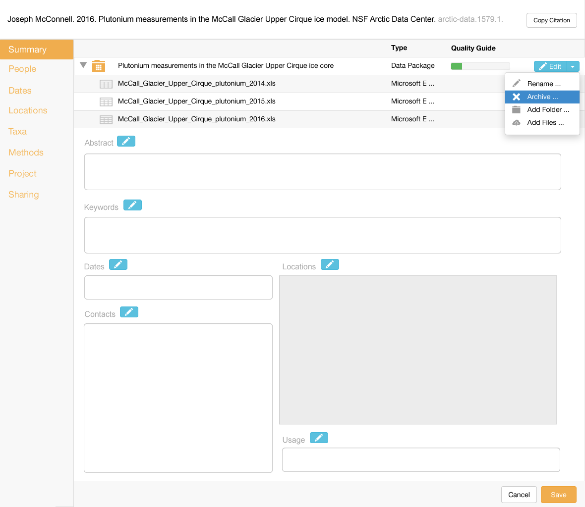
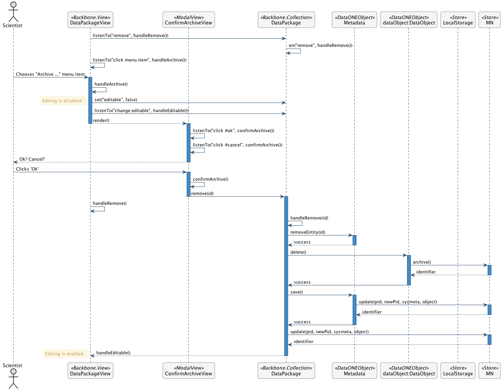

Archive a File      
==============

Scenario
--------

    As a scientist, I want to archive a file so it is no longer associated with newer versions of my dataset and it will not be discoverable, but will remain citable.

Summary
-------
A scientist should be able to archive a file, which is similar to deleting a file, but preserves read access in the event the file has been directly cited.  The goal is to enable archiving of data files, as well as data packages that contain the data files.  The display should immediately remove the items that are archived, and they should be asychronously archived in the repository. For uploads with large counts, the table should be responsive and not bog down the display.  If only a data file is archived, the science metadata and containing package should be updated to reflect this. 

Mockup Image
------------

Technical Sequence Diagram
--------------------------

.. 
    @startuml images/archive-a-file-sequence-diagram.png

      !include ../plantuml-styles.txt
      skinparam SequenceGroupBorderColor #AAAAAA
      skinparam SequenceGroupBorderThickness #AAAAAA

      actor "Scientist"
      participant DataPackageView as PackageView <<Backbone.View>>
      participant ConfirmArchiveView as ConfirmArchiveView  <<ModalView>>
      participant DataPackage as DataPackage <<Backbone.Collection>>
      participant Metadata as Metadata <<DataONEObject>>
      participant DataObject as "dataObject:DataObject" <<DataONEObject>>
      participant LocalStorage as LocalStore  <<Store>>
      participant MN as MN  <<Store>>

      PackageView -> DataPackage : listenTo("remove", handleRemove())
      DataPackage -> DataPackage : on("remove", handleRemove())

      PackageView -> PackageView : listenTo("click menu.item", handleArchive())
      Scientist -> PackageView : Chooses "Archive ..." menu item

      activate PackageView
        PackageView -> PackageView : handleArchive()
        PackageView -> DataPackage : set("editable", false)
        note left
          Editing is disabled
        end note
        PackageView -> DataPackage : listenTo("change:editable", handleEditable())
        PackageView --> ConfirmArchiveView : render()
      deactivate PackageView
        
      activate ConfirmArchiveView
        ConfirmArchiveView -> ConfirmArchiveView : listenTo("click #ok", confirmArchive())
        ConfirmArchiveView -> ConfirmArchiveView : listenTo("click #cancel", confirmArchive())
        ConfirmArchiveView --> Scientist: Ok? Cancel?
      deactivate ConfirmArchiveView
      
      Scientist -> ConfirmArchiveView : Clicks 'Ok'
      activate ConfirmArchiveView
        ConfirmArchiveView -> ConfirmArchiveView : confirmArchive()
        ConfirmArchiveView -> DataPackage : remove(id)
      deactivate ConfirmArchiveView
      
      activate DataPackage
      PackageView -> PackageView : handleRemove()
        DataPackage -> DataPackage : handleRemove(id)
        DataPackage -> Metadata : removeEntity(id)
      deactivate DataPackage
      
      activate Metadata
        Metadata --> DataPackage : success
      deactivate Metadata
        
      activate DataPackage
        DataPackage -> DataObject : destroy()
      deactivate DataPackage
        
      activate DataObject
        DataObject -> MN : archive()
      deactivate DataObject
        
      activate MN
        MN --> DataObject : identifier
      deactivate MN
     
      activate DataObject   
        DataObject -> DataPackage : success
      deactivate DataObject          

      activate DataPackage
        DataPackage -> Metadata : save()
      deactivate DataPackage
        
      activate Metadata
        Metadata -> MN : update(pid, newPid, sysmeta, object)
      deactivate Metadata
        
      activate MN
        MN --> Metadata : identifier
      deactivate MN
      
      activate Metadata
        Metadata -> DataPackage : success
      deactivate Metadata          
      
      activate DataPackage 
        DataPackage -> MN : update(pid, newPid, sysmeta, object)
      deactivate DataPackage
      
      activate MN
        MN --> DataPackage : identifier
      deactivate MN
        
      activate DataPackage
        DataPackage --> PackageView : handleEditable()
        note left
          Editing is enabled
        end note
      deactivate DataPackage
      
    @enduml

