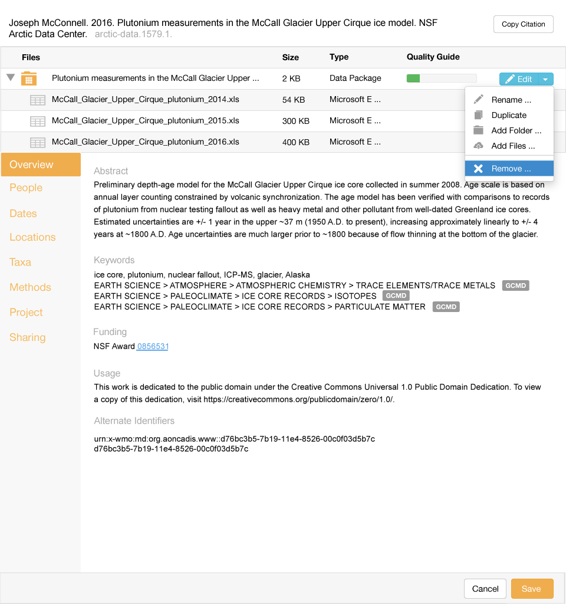
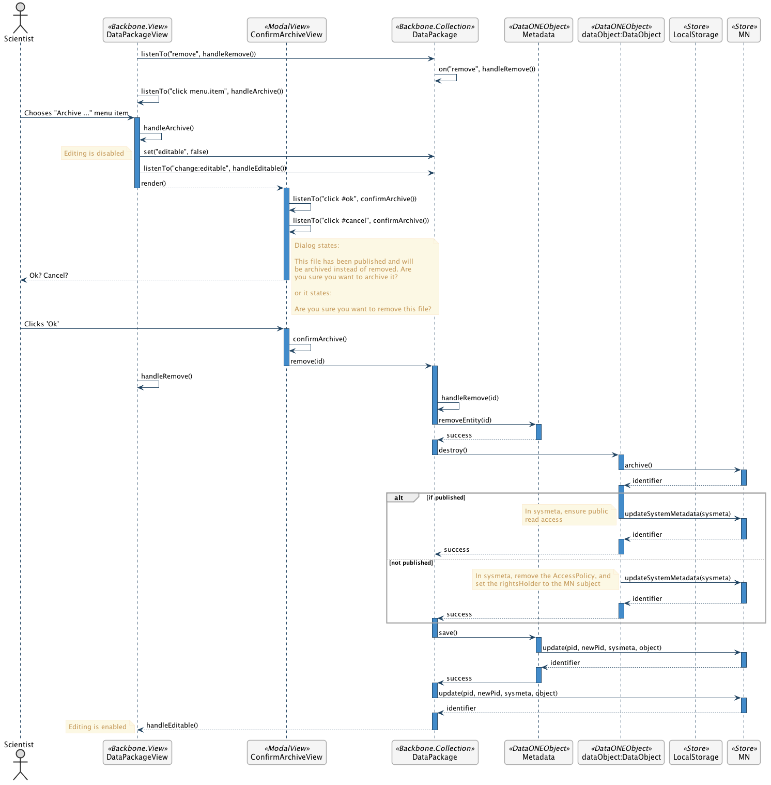

Archive a File      
==============

Scenario
--------

    As a scientist, I want to remove a file so it is no longer associated with newer versions of my dataset and it will not be discoverable, but will remain citable if published.

Summary
-------
A scientist should be able to remove a file, which is similar to deleting a file, but preserves read access in the event the file has been published and directly cited.  The goal is to enable archiving of data files, as well as data packages that contain the data files.  The display should immediately remove the items that are archived, and they should be asychronously archived in the repository. If the file has been published, it will be archived with public read access.  If it is not published, it is archived with all read access removed (including the original rights holder). If only a data file is archived, the science metadata and containing package should be updated to reflect this. 

Mockup Image
------------

Technical Sequence Diagram
--------------------------

.. 
    @startuml images/remove-a-file-sequence-diagram.png

      !include ../plantuml-styles.txt
      skinparam SequenceGroupBorderColor #AAAAAA
      skinparam SequenceGroupBorderThickness #AAAAAA

      actor "Scientist"
      participant DataPackageView as PackageView <<Backbone.View>>
      participant ConfirmArchiveView as ConfirmArchiveView  <<ModalView>>
      participant DataPackage as DataPackage <<Backbone.Collection>>
      participant EML as EML <<DataONEObject>>
      participant DataObject as "dataObject:DataObject" <<DataONEObject>>
      participant LocalStorage as LocalStore  <<Store>>
      participant MN as MN  <<Store>>

      PackageView -> DataPackage : listenTo("remove", handleRemove())
      DataPackage -> DataPackage : on("remove", handleRemove())

      PackageView -> PackageView : listenTo("click menu.item", handleArchive())
      Scientist -> PackageView : Chooses "Archive ..." menu item

      activate PackageView
        PackageView -> PackageView : handleArchive()
        PackageView -> DataPackage : set("editable", false)
        note left
          Editing is disabled
        end note
        PackageView -> DataPackage : listenTo("change:editable", handleEditable())
        PackageView --> ConfirmArchiveView : render()
      deactivate PackageView
        
      activate ConfirmArchiveView
        ConfirmArchiveView -> ConfirmArchiveView : listenTo("click #ok", confirmArchive())
        ConfirmArchiveView -> ConfirmArchiveView : listenTo("click #cancel", confirmArchive())
        ConfirmArchiveView --> Scientist: Ok? Cancel?
        note right
          Dialog states:
          
          This file has been published and will
          be archived instead of removed. Are
          you sure you want to archive it?
          
          or it states:
          
          Are you sure you want to remove this file?
        end note
      deactivate ConfirmArchiveView
      
      Scientist -> ConfirmArchiveView : Clicks 'Ok'
      activate ConfirmArchiveView
        ConfirmArchiveView -> ConfirmArchiveView : confirmArchive()
        ConfirmArchiveView -> DataPackage : remove(id)
      deactivate ConfirmArchiveView
      
      activate DataPackage
      PackageView -> PackageView : handleRemove()
        DataPackage -> DataPackage : handleRemove(id)
        DataPackage -> EML : removeEntity(id)
      deactivate DataPackage
      
      activate Metadata
        EML --> DataPackage : success
      deactivate Metadata
        
      activate DataPackage
        DataPackage -> DataObject : destroy()
      deactivate DataPackage
      
      activate DataObject
        DataObject -> MN : archive()
      deactivate DataObject
      
      activate MN
        MN --> DataObject : identifier
      deactivate MN
        
      alt if published   
        activate DataObject
          DataObject -> MN : updateSystemMetadata(sysmeta)
          note left
            In sysmeta, ensure public
            read access
          end note
        deactivate DataObject
        
        activate MN
          MN --> DataObject : identifier
        deactivate MN       
      
        activate DataObject
          DataObject --> DataPackage : success
        deactivate DataObject
        
      else not published
        
          DataObject -> MN : updateSystemMetadata(sysmeta)
          note left
            In sysmeta, remove the AccessPolicy, and
            set the rightsHolder to the MN subject
          end note
        
        activate MN
          MN --> DataObject : identifier
        deactivate MN       
        
        activate DataObject  
          DataObject --> DataPackage : success
        deactivate DataObject          
      activate DataPackage
        
      end
      

        DataPackage -> EML : save()
      deactivate DataPackage
        
      activate Metadata
        EML -> MN : update(pid, newPid, sysmeta, object)
      deactivate Metadata
        
      activate MN
        MN --> EML : identifier
      deactivate MN
      
      activate Metadata
        EML -> DataPackage : success
      deactivate EML          
      
      activate DataPackage 
        DataPackage -> MN : update(pid, newPid, sysmeta, object)
      deactivate DataPackage
      
      activate MN
        MN --> DataPackage : identifier
      deactivate MN
        
      activate DataPackage
        DataPackage --> PackageView : handleEditable()
        note left
          Editing is enabled
        end note
      deactivate DataPackage
      
    @enduml

