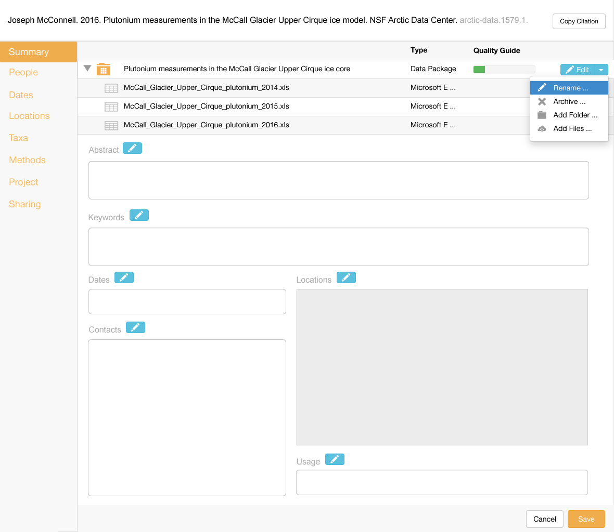
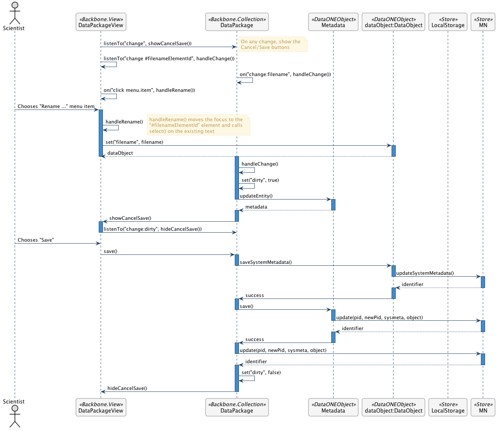

Rename a File       
=============

Scenario
--------

    As a scientist, I want to rename a file to a more appropriate name so I can easily keep my files organized.
    
Summary
-------
A scientist should be able to rename a file, including data files and metadata files (folder names).  The display should immediately show the new name, and they should be asychronously changed in the repository. The science metadata and containing package should be updated to reflect the change. 

Mockup Image
------------

Technical Sequence Diagram
--------------------------

.. 
    @startuml images/rename-a-file-sequence-diagram.png

      !include ../plantuml-styles.txt
      skinparam SequenceGroupBorderColor #AAAAAA
      skinparam SequenceGroupBorderThickness #AAAAAA

      actor "Scientist"
      participant DataPackageView as PackageView <<Backbone.View>>
      participant DataPackage as DataPackage <<Backbone.Collection>>
      participant Metadata as Metadata <<DataONEObject>>
      participant DataObject as "dataObject:DataObject" <<DataONEObject>>
      participant LocalStorage as LocalStore  <<Store>>
      participant MN as MN  <<Store>>

      PackageView -> DataPackage : listenTo("change", showCancelSave())
      note right
        On any change, show the 
        Cancel/Save buttons
      end note
      PackageView -> PackageView : listenTo("change #filenameElementId", handleChange())
      
      DataPackage -> DataPackage : on("change:filename", handleChange())
      
      PackageView -> PackageView : on("click menu.item", handleRename())
      
      Scientist -> PackageView : Chooses "Rename ..." menu item
      
      activate PackageView
        PackageView -> PackageView : handleRename()
        note right
          handleRename() moves the focus to the 
          "#filenameElementId" element and calls 
          select() on the existing text
        end note
        PackageView -> DataObject : set("filename", filename)
        activate DataObject
          DataObject --> PackageView : dataObject
        deactivate DataObject
      deactivate PackageView
      
      activate DataPackage
        DataPackage -> DataPackage : handleChange()
        DataPackage -> DataPackage : set("dirty", true)
        DataPackage -> Metadata : updateEntity()
      deactivate DataPackage
      
      activate Metadata
        Metadata --> DataPackage : metadata
      deactivate Metadata
      
      activate DataPackage
        DataPackage -> PackageView: showCancelSave()
      deactivate DataPackage
      
      activate PackageView
        PackageView -> DataPackage : listenTo("change:dirty", hideCancelSave())
      deactivate PackageView
      Scientist -> PackageView : Chooses "Save"

      PackageView -> DataPackage : save()

      activate DataPackage
        DataPackage -> DataObject : saveSystemMetadata()
      deactivate DataPackage
      
      activate DataObject
        DataObject -> MN : updateSystemMetadata()
      deactivate DataObject
      
      activate MN
        MN --> DataObject : identifier
      deactivate MN

      activate DataObject
        DataObject -> DataPackage : success
      deactivate DataObject
      
      activate DataPackage
        DataPackage -> Metadata : save()
      deactivate DataPackage
      
      activate Metadata
        Metadata -> MN : update(pid, newPid, sysmeta, object)
      deactivate Metadata
      
      activate MN
        MN --> Metadata : identifier
      deactivate MN
        
      activate Metadata
        Metadata -> DataPackage : success          
      deactivate Metadata
      
      activate DataPackage  
        DataPackage -> MN : update(pid, newPid, sysmeta, object)
      deactivate DataPackage
      
      activate MN
        MN --> DataPackage : identifier
      deactivate MN
      
      activate DataPackage
        DataPackage -> DataPackage : set("dirty", false)
        DataPackage -> PackageView : hideCancelSave()
      deactivate DataPackage
    @enduml

