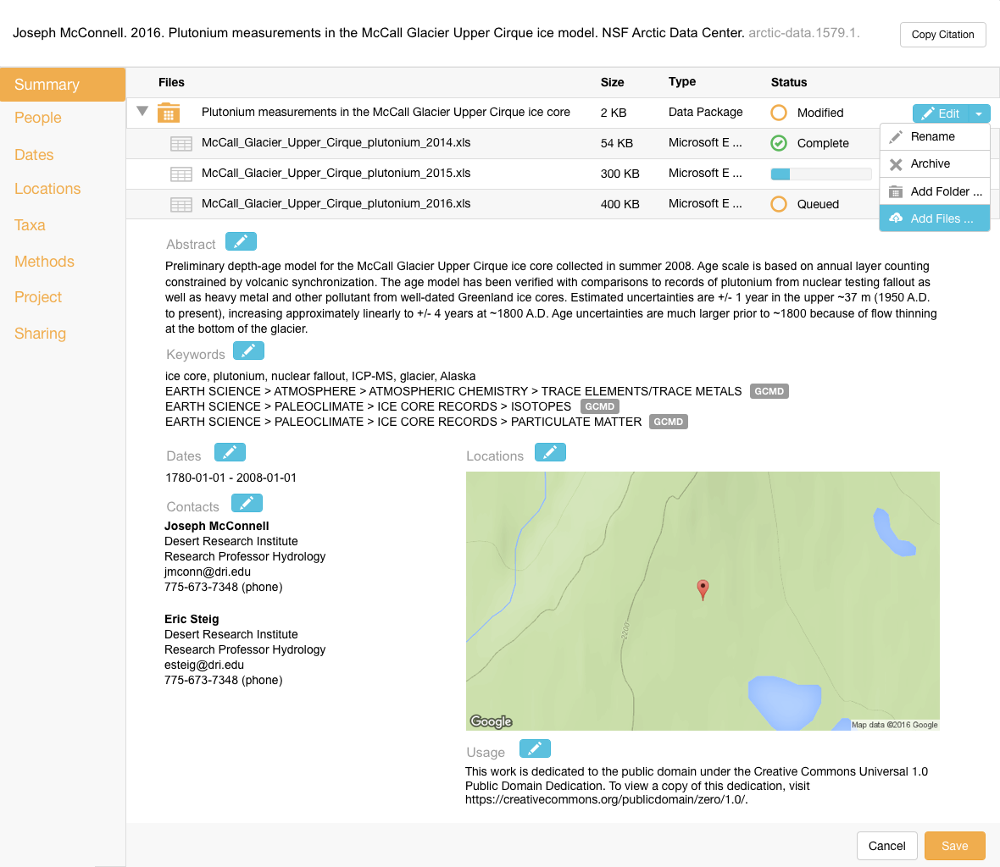

Upload Data         
===========

Scenario
--------

    As a scientist, I want to upload multiple files to the data repository so I can share them publicly and with colleagues.
    
Summary
-------
A scientist should be able to upload multiple files to the server by choosing them from their file system.  The goal is to provide batch upload of large numbers of files (100s to ~1000).  The application should queue each file and process the uploads sequentially, possibly with multiple connections for parallel uploads.  The display should allow scrolling through a table of files with their upload status.  For uploads with large counts, the table should be responsive and not bog down the display.  The metadata should be updated to reflect basic information about the file (name, size, online link, etc.). The package describing the data and metadata should also be updated. While uploads are occurring, the scientist should be able to edit other metadata fields.  

Mockup Image
------------

Technical Sequence Diagram
--------------------------

